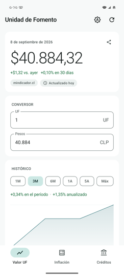
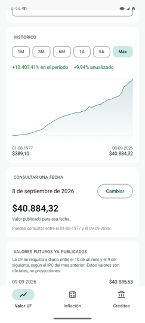
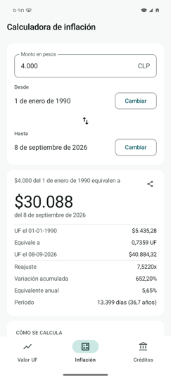
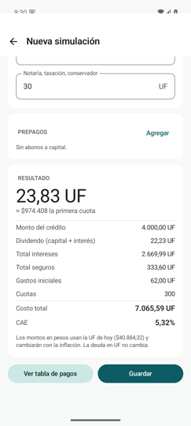
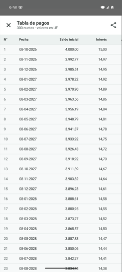

# Tickers

> Chile's **Unidad de Fomento** in your pocket: today's value, its whole history
> since 1977, an inflation calculator and a mortgage simulator.
>
> La **Unidad de Fomento** a mano: el valor de hoy, toda su historia desde 1977,
> una calculadora de inflación y un simulador de créditos hipotecarios.

**[⬇ Download the APK &nbsp;·&nbsp; Descargar el APK](https://github.com/ellokojavi/Tickers/releases/latest/download/Tickers.apk)** &nbsp;·&nbsp; **[🌐 Open the web app &nbsp;·&nbsp; Abrir la app web](https://ellokojavi.github.io/Tickers/)**

| Today's value<br><sub>El valor de hoy</sub> | History since 1977<br><sub>Historia desde 1977</sub> | Inflation calculator<br><sub>Calculadora de inflación</sub> |
|:---:|:---:|:---:|
|  |  |  |

| Mortgage simulation<br><sub>Simulación de crédito</sub> | Payment schedule<br><sub>Tabla de pagos</sub> | Dark theme<br><sub>Tema oscuro</sub> |
|:---:|:---:|:---:|
|  |  |  |

---

# For users · Para usuarios

## English

**Tickers** shows the numbers Chilean money is measured in, and helps you work
with them.

- **Today's value**, how much it moved since yesterday and over the last 30
  days, and a two-way UF ⇄ peso converter.
- **The whole daily history since August 1977** in one chart you can drag a
  finger across, plus a lookup for any single date. Days already published into
  the future are kept separate and labelled as official, never presented as a
  guess.
- **The dólar observado**, every business day back to January 1984, with the
  same chart and converter as the UF. Weekends and holidays have no publication
  and none is invented: the last published value is shown, with its date.
- **Bitcoin**, priced in dollars as the market does, converted to pesos with the
  Banco Central's observed rate, and shown in UF as well: the only way to read
  it net of Chilean inflation. Charts from an hour to five years, and four
  independent price sources so one exchange having a bad afternoon is not an
  outage.
- **An inflation calculator** that restates an amount between two exact dates:
  *$4.000 from 1 January 1990 is worth $30.086 today.*
- **A mortgage simulator** for `UF + x%` loans, covering insurance, stamp tax,
  fees, prepayments and the CAE, with the full payment schedule and a CSV
  export. Simulations are saved so you can come back and edit them.

**It works offline.** The complete daily series ships inside the app, so every
chart and every date works from the first launch with no connection. When there
is one, it refreshes the day's value in the background.

**Nothing is collected.** No account, no ads, no tracking, no analytics. It
asks for no sensitive permission and never prompts you for one: beyond internet
access it declares only what the background-refresh library needs, none of
which touches your data.

**There is also a web version** at
[ellokojavi.github.io/Tickers](https://ellokojavi.github.io/Tickers/). It does
everything the Android app does, works offline once opened, and offers to put
itself on your home screen so the address never has to be typed again. It needs
no store and no account, which makes it the way to use this on an iPhone.

**Requirements:** Android 8.0 or newer for the APK; any current browser for the
web version. The APK is signed but is not distributed through Google Play, so
Android will ask you to allow the install from your file manager or browser the
first time.

## Español

**Tickers** muestra las cifras con que se mide el dinero en Chile y te ayuda a
trabajar con ellas.

- **El valor de hoy**, cuánto se movió respecto de ayer y en los últimos 30
  días, y un conversor UF ⇄ pesos en ambos sentidos.
- **Toda la historia diaria desde agosto de 1977** en un gráfico que puedes
  recorrer con el dedo, más la consulta de cualquier fecha. Los días ya
  publicados hacia adelante van aparte y marcados como oficiales, nunca
  presentados como una estimación.
- **El dólar observado**, cada día hábil desde enero de 1984, con el mismo
  gráfico y conversor que la UF. Los fines de semana y feriados no tienen
  publicación y no se inventa ninguna: se muestra el último valor publicado, con
  su fecha.
- **Bitcoin**, cotizado en dólares como lo hace el mercado, convertido a pesos
  con el dólar observado del Banco Central, y también en UF: la única forma de
  leerlo descontada la inflación chilena. Gráficos desde una hora hasta cinco
  años, y cuatro fuentes de precio independientes para que una casa de cambio
  con un mal día no sea una caída.
- **Una calculadora de inflación** que reajusta un monto entre dos fechas
  exactas: *$4.000 del 1 de enero de 1990 equivalen a $30.086 de hoy.*
- **Un simulador de créditos hipotecarios** UF + tasa, con seguros, impuesto de
  timbres, comisiones, prepagos y CAE, con la tabla de pagos completa y
  exportación a CSV. Las simulaciones quedan guardadas para volver a editarlas.

**Funciona sin conexión.** La serie diaria completa viene dentro de la app, así
que todos los gráficos y todas las fechas funcionan desde el primer arranque sin
internet. Cuando lo hay, actualiza el valor del día en segundo plano.

**No recoge nada.** Sin cuenta, sin publicidad, sin seguimiento, sin analítica.
No pide ningún permiso sensible ni te muestra un diálogo de permisos: además del
acceso a internet solo declara los que necesita la librería de actualización en
segundo plano, y ninguno toca tus datos.

**También hay versión web** en
[ellokojavi.github.io/Tickers](https://ellokojavi.github.io/Tickers/). Hace todo
lo que hace la app de Android, funciona sin conexión una vez abierta, y te
ofrece dejarla en tu pantalla de inicio para no tener que escribir la dirección
nunca más. No necesita tienda ni cuenta, que es lo que la vuelve la forma de
usar esto en un iPhone.

**Requisitos:** Android 8.0 o superior para el APK; cualquier navegador actual
para la versión web. El APK está firmado pero no se distribuye por Google Play,
así que Android te pedirá autorizar la instalación desde tu gestor de archivos o
navegador la primera vez.

**Para recibir actualizaciones automáticas**, agrega este repositorio a
[Obtainium](https://github.com/ImranR98/Obtainium), una app libre y gratuita que
sigue las releases de GitHub. Pega `https://github.com/ellokojavi/Tickers` una
vez y las nuevas versiones te llegan solas, sin pasar por ninguna tienda.

---

# Product and engineering

Everything below documents what was built and why: the requirements it was held
to, where the data comes from and how it is validated, the calculation models,
the architecture, and the test strategy. None of it is needed to use the app.

## Contents

- [Why this exists](#why-this-exists)
- [Features](#features)
- [Requirements](#requirements)
- [Data sources](#data-sources)
- [How the inflation index is derived](#how-the-inflation-index-is-derived)
- [Mortgage model](#mortgage-model)
- [Architecture](#architecture)
- [Building](#building)
- [Testing](#testing)
- [Project layout](#project-layout)
- [Roadmap](#roadmap)
- [Iconography](#iconography)
- [Disclaimer](#disclaimer)
- [License](#license)

## Why this exists

The UF changes **every single day**, and its value for the coming weeks is
already published. Most conversion tools ignore that, either by showing only
today's value or by extrapolating one. Meanwhile, comparing prices across
decades in Chile requires splicing CPI series, and mortgage quotes arrive as a
single monthly figure with the insurance, taxes and fees folded invisibly into
it.

This app treats all three as the same problem: making an indexed unit legible.

---

## Features

### UF value

One screen, because "what is the UF worth today" and "what was it worth then"
are the same question at different points in time.

- Current UF value in Chilean pesos, with the exact publication date.
- Change versus the previous day (absolute) and versus 30 days ago (percentage).
- Two-way UF ⇄ CLP converter. The peso side is whole pesos: Chile has not used
  centavos for decades. The headline keeps its two decimals because the UF
  itself is published that way.
- **Share the card** as preformatted text through the system share sheet:
  WhatsApp, Telegram, mail, notes, anywhere.
- **The history is always on screen**, not a mode to switch into: range
  selector (1M / 3M / 6M / 1Y / 5Y / Max), the change over that range both
  cumulative and annualised, and a chart whose **two ends are labelled with
  their date and value**, so it can be read without touching it. It **ends
  today**: the series runs past today, but a historical chart is a record of
  what has happened, and the days already published beyond it have their own
  card.
- Touch scrubbing. **The headline value never changes while scrubbing**. The
  explored day is reported separately, so the screen cannot misstate what the
  UF is worth today.
- Date lookup for any single day, with the calendar **bounded by the published
  horizon**: a day whose UF does not exist yet cannot be selected at all, and
  the lookup never answers with a neighbouring day's value.
- Already-published future values, explained and marked as official.
- A day-by-day list of the selected range, **collapsed by default**, because it runs
  to hundreds of rows and is a reference, not the main event.
- Companion indicators: IVP, US dollar, euro, UTM, monthly CPI.
- An explicit **data source badge**. The app never hides where a number came
  from, and marks whether that source is official.
- Freshness indicator, and a visible warning when showing cached data.
- An **"Acerca de" screen** carrying the independence notice, the source
  attribution the CMF's terms require, the method, and the financial
  disclaimer. It is reached from a quiet line at the foot of the screen or by
  tapping the source badge, and never interrupts: there is no launch dialog and
  nothing to acknowledge.

Future values are never presented as history or as a projection: they sit in
their own card, labelled as already official. When a requested date lies beyond
the published horizon, the app says so rather than extrapolating.

### Inflation

Restates an amount between **two dates**, not two months.

- Day-exact: the amount is converted into UF on the origin date and back into
  pesos on the target one. This is the mechanism Chilean contracts, rents and
  debts are actually re-adjusted with.
- Reports the UF on both dates, the amount in UF units, the adjustment factor,
  the accumulated variation and the equivalent annual rate.
- **Share the equivalence** as preformatted text through the system share sheet.
  The equivalence leads, because that is what gets quoted in a chat; the
  arithmetic behind it follows for anyone who wants to check it.
- Both calendars are bounded by the series, so a date with no published UF
  cannot be picked. When the end date is not today, a **"Hoy"** shortcut sits
  beside it: coming back is the most common correction and should not cost a
  trip through the calendar.
- Coverage: **1 August 1977 to the last published day**.

**Why dates rather than months.** The screen used to ask for months and show
two readings side by side: one through a monthly CPI index and one through UF
units. They answered subtly different questions and differed by a few percent,
because the UF carries the CPI with a two-month lag by construction.

The reason for the monthly granularity was the CPI itself: the INE publishes
one index per month, so there is no such thing as the price level on a given
day. The UF, by contrast, is published every calendar day. Asking for dates
therefore makes the question well posed and leaves exactly one answer, which is
why the parallel reading is gone.

The consequence is that the reported figure is the UF re-adjustment, which
tracks inflation with the UF's own lag rather than reproducing the INE's
month-on-month series. The screen says so.

### Mortgage simulator

- `UF + x%` loans on the French amortisation system (constant capital + interest
  payment).
- **A user-chosen due date for the first instalment**, so the schedule carries
  real dates rather than an assumed "one month from today". Later instalments
  fall on the same day each month, clamped to the last day of shorter months
  exactly as a lender would.
- Complete payment table: opening balance, interest, principal, dividend, life
  insurance, fire insurance, prepayment, monthly total and closing balance.
  Every row is in UF, with peso equivalents at the current UF value.
- Opening a **saved** simulation leads with the result and the payment table;
  the editable form and its update action sit below. A **new** simulation leads
  with the form. Consulting and creating are different jobs.
- Cost inputs: *desgravamen* (percentage of the outstanding balance),
  *incendio y sismo* (fixed monthly UF), origination fee, stamp tax
  (*impuesto de timbres*), and notary/appraisal/registry costs.
- **CAE** (*Carga Anual Equivalente*) solved from the real cash flows.
- Prepayments (*abonos a capital*), either shortening the term or lowering the
  payment.
- **Both rate conventions** are supported. See [Mortgage model](#mortgage-model).
- CSV export of the full schedule, shared through the Android share sheet.

### Saved simulations

Create, read, update, duplicate and delete named simulations. Persisted locally
in Room; deletions offer an undo. Nothing leaves the device.

---

## Requirements

### Functional

| ID | Requirement |
|----|-------------|
| RF-1 | Display today's official UF value with its publication date |
| RF-2 | Display daily change and 30-day percentage change |
| RF-3 | Convert UF ⇄ CLP in both directions |
| RF-4 | Display companion indicators (IVP, USD, EUR, UTM, CPI) |
| RF-5 | Query the UF value for any date within coverage |
| RF-5b | Present today's value and the historical series as one destination, with the history always visible |
| RF-5c | Refuse to answer for a date with no published value, and make such dates unselectable |
| RF-6 | Display already-published future UF values, explicitly marked as official |
| RF-7 | Never extrapolate or project a UF value that has not been published |
| RF-8 | Chart the series over selectable ranges with touch scrubbing, without ever altering the headline value |
| RF-8b | Report the range's change both cumulatively and annualised |
| RF-8c | Label both ends of the chart with their date and value |
| RF-8e | End the chart on today, never on a published future day |
| RF-8d | Keep the day-by-day list collapsed until requested |
| RF-9 | Restate an amount between any two dates, at day precision, through the UF |
| RF-10 | Show the UF on both dates and the amount in UF units |
| RF-11 | Report the adjustment factor, accumulated variation and annualised rate |
| RF-12 | Make out-of-coverage dates unselectable, and explain the coverage |
| RF-13 | Simulate a `UF + x%` mortgage and produce a full amortisation schedule |
| RF-13b | Let the user set the first instalment's due date and derive every later date from it |
| RF-14 | Support both annual→monthly rate conventions used in Chile |
| RF-15 | Model life and property insurance, fees, stamp tax and upfront costs |
| RF-16 | Compute the CAE from actual cash flows |
| RF-17 | Model prepayments, reducing either term or payment |
| RF-18 | Create, read, update, duplicate and delete saved simulations |
| RF-18b | Open a saved simulation on its result; open a new one on its form |
| RF-19 | Persist simulations across app restarts and updates |
| RF-20 | Export a schedule to CSV and share it |
| RF-20b | Share today's UF card as preformatted text via the system share sheet |
| RF-20c | Share a restatement the same way |
| RF-21 | Refresh data daily in the background and on manual pull |
| RF-22 | Operate fully offline from cached and bundled data |
| RF-22b | Ship the complete daily series and refresh only what is genuinely new |
| RF-22c | Reject implausible values from any source rather than storing them |
| RF-23 | Label the origin of every value and whether the source is official |

### Non-functional

| ID | Requirement |
|----|-------------|
| RNF-1 | Android 8.0+ (minSdk 26), targetSdk 35 |
| RNF-2 | Spanish (Chile) throughout; `es-CL` number formatting (`$40.880,36`) on input as well as output, and on **every** figure, counts included |
| RNF-3 | Functional with no network connection; never a blank screen |
| RNF-4 | APK under 15 MB; the minified release build is **1,7 MB** |
| RNF-5 | Cold start under 1.5 s |
| RNF-6 | No analytics, no account, no personal data. No runtime permission prompts; `INTERNET` plus the normal-level permissions WorkManager adds (`WAKE_LOCK`, `RECEIVE_BOOT_COMPLETED`, `FOREGROUND_SERVICE`) |
| RNF-7 | All monetary arithmetic in `BigDecimal`; `Double` is never used for money |
| RNF-8 | WCAG AA contrast, font-scaling support, TalkBack labels |
| RNF-9 | Light and dark themes, following the system until set manually |
| RNF-10 | Calculation engines are pure Kotlin, testable without a device |
| RNF-12 | State independence from the CMF, Banco Central and INE, and attribute sources as their terms require, without interrupting the user |
| RNF-11 | Chilean iconography (the flag as the app mark, the copihue and condor as illustrations) without breaking the minimalist palette |

---

## Data sources

| Source | Role | Key | Notes |
|--------|------|-----|-------|
| [CMF Chile](https://api.cmfchile.cl) | **Primary, official** | Required, free | The financial regulator's own API. Quota: 10,000 requests/month |
| [mindicador.cl](https://mindicador.cl) | Fallback | None | Third-party mirror of Banco Central data |
| Bundled asset | Offline seed | None | **The complete daily series**, Aug 1977 → build date |

The app tries the official source first and falls back automatically.

### Terms, and what they require

The CMF's [terms of use](https://api.cmfchile.cl/terminos-de-uso.html) authorise
publishing its data in a third-party application, on one condition: the source
must be named **with a link to its site** wherever the data is republished. The
app satisfies this in its "Acerca de" screen, which names the CMF and links to
cmfchile.cl. That is a requirement, not a courtesy.

mindicador.cl publishes **no terms of use at all**: no licence, no stated
permission to redistribute, no rate limits. It mirrors Banco Central data and
is credited in the same screen, but the position is legally undefined, which is
the reason it is the fallback and not the primary. Anyone shipping this app
should configure a CMF key so it runs on the source that explicitly authorises
what the app does, and regenerate the bundled dataset from that source too.

**The entire daily series ships inside the APK**: about 18.000 days from
August 1977, roughly 50 kB compressed. It is loaded into the database on first
launch (0,6 s, off the main thread), so every chart and every date lookup works
offline from the very first run, and a refresh only ever asks for the years the
cache does not already cover, normally just the current one. Concurrent
refreshes are coalesced, so the background worker and the screen opening at the
same moment issue one request, not two. The CMF quota is therefore never under
pressure.

### The data is validated, not trusted

The public feed is not clean. It serves `608,15` for 2014-12-29 and `607,38`
for 2014-12-30, where the real UF was about 24.627. Both the generator and the
running app therefore reject any value that moves more than 1% per elapsed day,
roughly four times the largest genuine daily change in the whole 49-year
series (0,2633%). Rejected days, and any the source simply omits, are then **reconstructed from
their own re-adjustment period**. Inside a period, which runs from the 10th of one month to
the 9th of the next, the UF grows at a constant daily factor by construction,
so a missing day is a term of a known geometric progression rather than a
guess. December 2014 is the clearest case: the UF was frozen at 24.627,10 for
that entire period because November's CPI was 0,0%, so the two corrupted days
recover their exact published value. Reconstruction is refused when a gap
straddles a period boundary, where the factor changes.

The result is a complete series: 17.937 days with no holes.

### Configuring the CMF API key

Request a free key at [api.cmfchile.cl](https://api.cmfchile.cl), then add it to
`local.properties` (which is **not** committed):

```properties
CMF_API_KEY=your_key_here
```

Leaving it blank is supported: the app reports the CMF source as unavailable and
uses the fallback. The key is injected at build time via `BuildConfig` and never
appears in version control.

---

## How the inflation index is derived

Chile's CPI is published as a **monthly percentage with one decimal**. Chaining
those figures from 1990 to today means multiplying ~430 rounded numbers, and the
rounding error compounds.

This app does not chain them. It derives the price index from the **UF itself**.

The UF is re-adjusted daily so that:

```
UF(9th of month M+1) / UF(9th of month M) = 1 + CPI variation of month M-1
```

The UF is published to two decimals on a value in the tens of thousands, giving
roughly `1e-7` relative precision, several orders of magnitude better than a
one-decimal percentage. So the index is simply:

```
index(month m) = UF value on the 9th of month m+2
```

**This is verified, not assumed.** `UfDailySeedParseTest` reproduces every
published monthly CPI figure for 2024 from the UF series; the deviation is
within the published figure's own single decimal in all eleven months. The test
runs on the exact asset file shipped inside the APK, so a corrupted
regeneration fails the build rather than the phone.

The calculator itself no longer needs this mapping, since it converts between
dates through the UF directly, but the relationship is what makes the series
trustworthy as an inflation measure, so it stays under test.

The bundled dataset is regenerated with:

```bash
python3 tools/build_uf_daily_seed.py
```

It refuses to write a truncated series and prints every value it rejects.

---

## Mortgage model

Payments follow the French system, a constant capital-plus-interest amount:

```
payment = P · i / (1 − (1 + i)^(−n))
```

Insurance is charged **on top of** that payment and is deliberately not constant:
the *desgravamen* premium tracks the outstanding balance, so the real monthly
outflow falls over the life of the loan. The app shows both figures.

### The rate convention caveat

Chilean lenders quote an annual rate but do not all convert it to a monthly rate
the same way:

- `monthly = annual / 12`, the common convention, and the app's default
- `monthly = (1 + annual)^(1/12) − 1`, the effective equivalent, always slightly
  cheaper

Rather than pick one and silently mismatch a real bank quote, **both are
selectable in the UI**. If a simulation does not match a lender's own figure,
switching the convention is the first thing to try.

### CAE

The *Carga Anual Equivalente* is solved by bisection: the app finds the monthly
rate at which the present value of every payment the borrower makes (dividend,
insurance, prepayments) equals the loan amount net of upfront costs, then
annualises it. With no fees and no insurance it converges on the effective
annual rate, which is asserted in the test suite.

---

## Architecture

```
Kotlin · Jetpack Compose (Material 3) · MVVM · unidirectional state
│
├── ui/          Compose screens + ViewModels, StateFlow-driven
│   ├── value/   UF today + history (one screen)
│   ├── inflation/
│   └── credit/
├── domain/      Pure Kotlin. No Android imports.
│   ├── model/   Data classes
│   └── engine/  UfEngine · InflationEngine · MortgageEngine
├── data/
│   ├── remote/  Retrofit + OkHttp + kotlinx.serialization
│   │            CmfDataSource (primary) → MindicadorDataSource (fallback)
│   ├── local/   Room: uf_values · indicators · simulations
│   ├── seed/    Bundled full daily UF series
│   ├── prefs/   DataStore settings
│   └── repo/    Cache-first repositories
├── work/        WorkManager daily sync
└── di/          Hand-written dependency container
```

**Two decisions worth stating:**

*Manual DI instead of Hilt.* The object graph is single-level and shallow. A
hand-written container removes an annotation processor, a plugin, and an entire
class of build failures, at the cost of about forty lines.

*The whole series bundled instead of paged from the network.* Eighteen thousand
days cost about 50 kB compressed, less than one screenshot, and buy offline
charts, instant range switching and a fraction of the API traffic. Charts thin
the window to 400 points before drawing, because a phone cannot resolve more
and rebuilding an 18.000-segment path on every pointer event would make
scrubbing crawl.

*Numeric fields group thousands as you type.* The field's state stays raw and
only the display is grouped, which means the separator is never something the
user has to type. Fields previously accepted a typed "." and then discarded it
when parsing, so "4.5" in a rate field silently became 45. A typed "." or ","
is now always the decimal separator. Android's numeric keypad offers both, and
which one appears depends on the phone's locale, not the app's.

*A hand-drawn chart instead of a charting library.* The app needs one line, one
gradient fill and a scrub cursor. A dependency for that would cost more in size
and API surface than it saves.

Reads always come from Room, so every screen renders offline. The network is
only ever a way to refresh that cache; a failed refresh degrades to a visible
staleness warning, never to an empty screen or a fabricated number.

---

## Building

**Prerequisites:** JDK 17, Android SDK Platform 35, Build-Tools 35.

```bash
git clone <repo-url>
cd Tickers
echo "sdk.dir=/path/to/android/sdk" > local.properties
./gradlew assembleDebug
```

The APK lands in `app/build/outputs/apk/debug/`.

```bash
./gradlew installDebug          # install on a connected device
./gradlew assembleRelease       # minified, signed release build
```

Debug builds use the `.debug` application ID suffix, so they install alongside a
release build.

### Release signing

Create a keystore and a `keystore.properties` at the project root (both are
gitignored):

```properties
storeFile=tickers-release.jks
storePassword=...
keyAlias=...
keyPassword=...
```

Without that file the release variant still builds, unsigned. The minified
release APK is about 1.6 MB.

---

## Testing

```bash
./gradlew test                  # JVM unit tests, no device needed
./gradlew connectedAndroidTest  # instrumented tests, needs a device or emulator
```

The engines are pure Kotlin precisely so the numerical correctness of the app
can be verified without an emulator. See [TESTING.md](TESTING.md) for the full
strategy, coverage matrix and manual QA checklist.

---

## Project layout

```
Tickers/
├── app/
│   ├── src/main/
│   │   ├── assets/uf_daily.txt            Full daily UF series (1977→)
│   │   ├── java/cl/tickers/app/           Source
│   │   └── res/                           Resources
│   ├── src/test/                          JVM unit tests
│   └── src/androidTest/                   Instrumented tests
├── tools/build_uf_daily_seed.py           Regenerates the bundled dataset
├── README.md
└── TESTING.md
```

---

## Roadmap

**v0.9.1 (current)**
Everything above: the UF value with its full history, a day-exact inflation
calculator, and a complete mortgage simulator with saved simulations and CSV
export. 159 tests passing; debug and minified release builds verified on an
emulator.

Held at 0.9 rather than 1.0 for one honest reason: the default annual-to-monthly
rate convention has not yet been checked against a published bank quote. Both
conventions are selectable and the app says so, but until that check is done,
calling it 1.0 would overstate it.

### Distribution

The app is free of proprietary dependencies: no Play Services, no Firebase, no
analytics, and it builds from source with no secrets, since the CMF key falls
back to an empty string. That makes it eligible for the free channels that
require exactly those things, which is worth stating because most apps are not:

- **[IzzyOnDroid](https://apt.izzysoft.de/fdroid/)**, an F-Droid-compatible
  repository that serves the prebuilt APK straight from these GitHub releases.
- **F-Droid** proper, which builds from source itself. Slower to get in.
- **Obtainium**, covered above, which needs nothing from this side at all.

Google Play charges a one-time US$25 registration fee and is the only channel
most people in Chile actually search. The free routes are worth adding to it,
not substituting for it.

**Toward v1.0**
- Validate the default rate convention against published bank quotes
- PDF export of payment schedules
- Side-by-side comparison of up to three simulations
- Home-screen widget

**Considered, not committed**
UF change notifications; UTM and tax calculators; iOS.

---

## Iconography

The app mark is the **Chilean flag in a circle** with the UF's own series
climbing across it.

A launcher crops the central 72×72 of a 108×108 adaptive icon and scales it up,
so the circle is drawn at exactly that radius: on a circular mask it fills the
icon edge to edge, and on a squircle it stays a clean circle rather than being
cut into a rounded square. The source artwork separated the green line from the
red field with a glow; a vector drawable cannot blur, so a white underlay stroke
does the same job. Without it the bright green vibrates against the red. The
themed (monochrome) variant drops the flag, which cannot survive a single tint,
and keeps the ascending series.

Empty states reuse the symbol of the thing that is missing: the mortgage list
shows the same bank mark its tab carries, and an empty chart shows a **condor**,
drawn and compared at real sizes first, which is why it only ever appears
large: below about 48px it loses its silhouette and reads as an insect.

A copihue was drawn for both the app mark and the empty simulations state
before the flag and the bank replaced them. The iterations are worth keeping in
mind if the mark is ever revisited: an outline copihue reads as a scribble at
list sizes, a narrow bell with steeply recurved tepals stops reading as a
flower, and only a wide filled bell with tepals flaring at about 35° survives.

## Disclaimer

This app is an independent tool. It is not affiliated with, endorsed by, or
connected to the Comisión para el Mercado Financiero (CMF), the Banco Central de
Chile, the Instituto Nacional de Estadísticas (INE), or any bank.

Figures are provided for information only and are **not** financial advice. A
mortgage simulation is a model, not a quote: real lenders apply their own
conventions, fees and insurance pricing. Always confirm with the institution
before making a decision.

---

## License

MIT. See [LICENSE](LICENSE).
