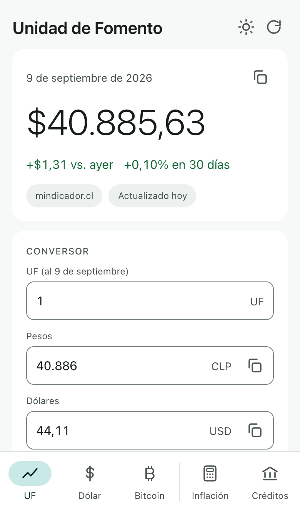
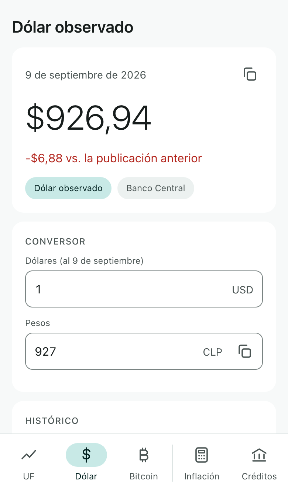
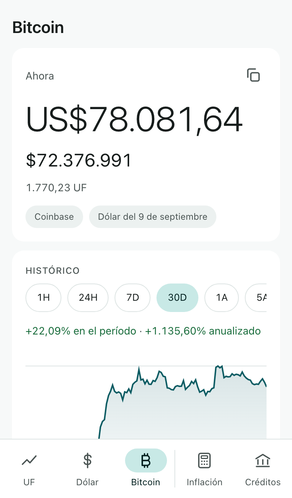
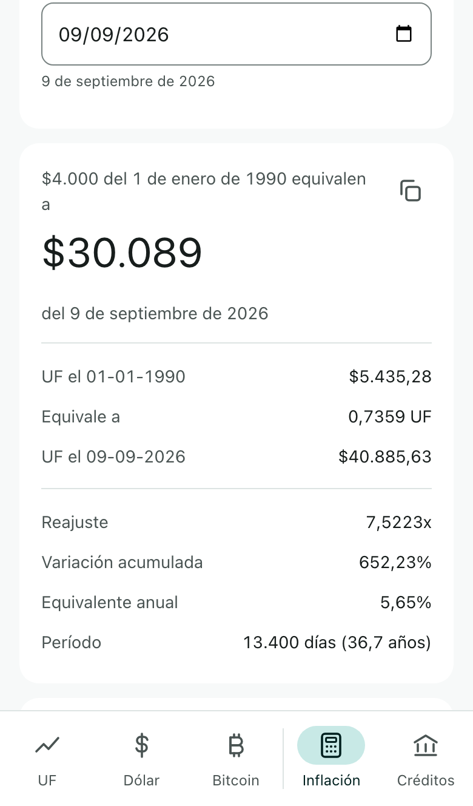
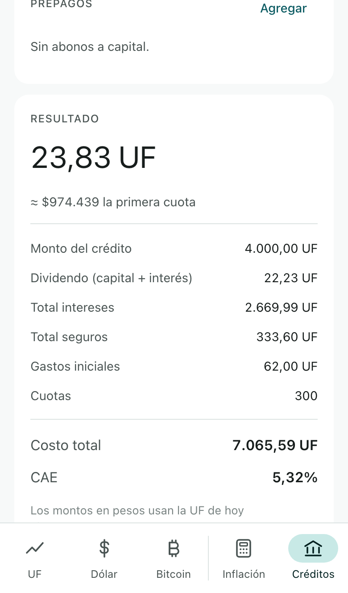
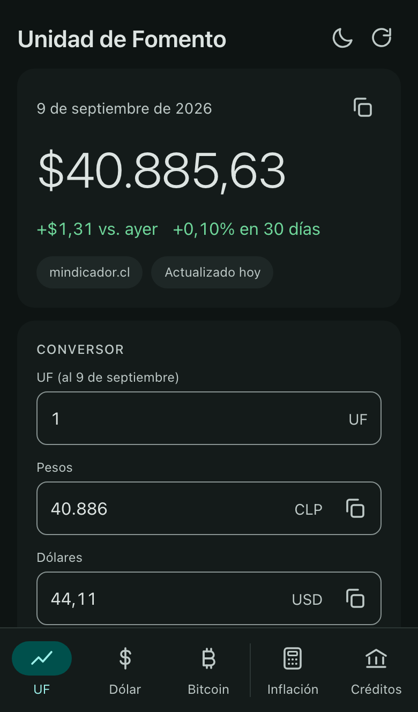

<h1 align="center">
  <br>
  Tickers
</h1>

<p align="center">
  <b>The numbers Chilean money is measured in, on your phone and in your browser.</b><br>
  <sub>Las cifras con que se mide el dinero en Chile, en tu teléfono y en tu navegador.</sub>
</p>

<p align="center">
  <a href="https://ellokojavi.github.io/Tickers/"><b>🌐 Open the web app · Abrir la app web</b></a>
  &nbsp;·&nbsp;
  <a href="https://github.com/ellokojavi/Tickers/releases/latest"><b>⬇ Android APK</b></a>
</p>

<p align="center">
  <a href="https://github.com/ellokojavi/Tickers/actions/workflows/checks.yml"></a>
  <a href="https://github.com/ellokojavi/Tickers/actions/workflows/deploy-web.yml"></a>
  <a href="https://github.com/ellokojavi/Tickers/actions/workflows/refresh-data.yml"></a>
  <a href="https://github.com/ellokojavi/Tickers/releases/latest"></a>
  <a href="LICENSE"></a>
</p>

| UF | Dólar observado | Bitcoin |
|:---:|:---:|:---:|
|  |  |  |

| Inflación | Créditos hipotecarios | Tema oscuro |
|:---:|:---:|:---:|
|  |  |  |

<sub>The web app on a phone-sized screen. The Android app shows the same screens, natively.</sub>

---

## Para usuarios

**Tickers** reúne en un solo lugar la UF, el dólar observado y el bitcoin, con
toda su historia, y dos herramientas para trabajar con ellos: una calculadora
de inflación exacta al día y un simulador de créditos hipotecarios.

- **UF.** El valor de hoy, cuánto se movió respecto de ayer y en 30 días, un
  conversor UF ⇄ pesos ⇄ dólares, toda la serie diaria desde agosto de 1977 en
  un gráfico que se recorre con el dedo, la consulta de cualquier fecha y los
  valores ya publicados hacia adelante, marcados como oficiales.
- **Dólar observado.** Cada día hábil desde enero de 1984, con el mismo gráfico
  y conversor. Los fines de semana y feriados no tienen publicación y no se
  inventa ninguna: se muestra el último valor publicado, con su fecha.
- **Bitcoin.** Cotizado en dólares como lo hace el mercado, convertido a pesos
  con el dólar observado del Banco Central y también expresado en UF, que es la
  única forma de leerlo descontada la inflación chilena. Gráficos desde una hora
  hasta cinco años.
- **Calculadora de inflación.** Reajusta un monto entre dos fechas exactas:
  *$4.000 del 1 de enero de 1990 equivalen a $30.089 de hoy.*
- **Simulador de créditos hipotecarios.** Créditos UF + tasa con seguros,
  impuesto de timbres, comisiones, prepagos y CAE, con la tabla de pagos
  completa y exportación a CSV. Las simulaciones quedan guardadas.

**Funciona sin conexión.** Las series completas vienen dentro de la app, así que
todos los gráficos y todas las fechas funcionan desde el primer arranque, sin
internet. Cuando lo hay, actualiza el valor del día.

**No recoge nada.** Sin cuenta, sin publicidad, sin seguimiento, sin analítica.
Las simulaciones se guardan solo en tu dispositivo y no salen de él.

**Nunca inventa un número.** Un valor que no está publicado no se proyecta ni se
estima: la app dice que no existe. Cada cifra lleva su fuente y su fecha.

**Cómo tenerla.**

- **En el navegador**, en [ellokojavi.github.io/Tickers](https://ellokojavi.github.io/Tickers/).
  Funciona en cualquier navegador actual, también sin conexión una vez abierta,
  y se puede dejar en la pantalla de inicio del teléfono. Es la forma de usarla
  en un iPhone.
- **En Android**, con el [APK de la última versión](https://github.com/ellokojavi/Tickers/releases/latest).
  Requiere Android 8.0 o superior. El APK está firmado pero no se distribuye por
  Google Play, así que Android pedirá autorizar la instalación la primera vez.
  Para recibir actualizaciones solas, agrega este repositorio a
  [Obtainium](https://github.com/ImranR98/Obtainium).

## For users

**Tickers** brings together the UF, the observed dollar and bitcoin, with their
whole history, plus two tools to work with them: a day-exact inflation
calculator and a mortgage simulator.

- **UF.** Today's value, its change since yesterday and over 30 days, a UF ⇄
  peso ⇄ dollar converter, the entire daily series since August 1977 in a chart
  you can scrub, a lookup for any date, and the days already published into the
  future, labelled as official.
- **Dólar observado.** Every business day since January 1984, with the same
  chart and converter. Weekends and holidays have no publication and none is
  invented: the last published value is shown, with its date.
- **Bitcoin.** Priced in dollars as the market does, converted to pesos with the
  Banco Central's observed rate, and expressed in UF as well, the only way to
  read it net of Chilean inflation. Charts from one hour to five years.
- **Inflation calculator.** Restates an amount between two exact dates:
  *$4.000 of 1 January 1990 is worth $30.089 today.*
- **Mortgage simulator.** `UF + x%` loans with insurance, stamp tax, fees,
  prepayments and the CAE, the full payment schedule and a CSV export.
  Simulations are saved.

**It works offline.** The complete series ship inside the app, so every chart
and every date works from the first launch with no connection. When there is
one, it refreshes the day's value.

**Nothing is collected.** No account, no ads, no tracking, no analytics.
Simulations are stored on your device only and never leave it.

**It never makes a number up.** A value that has not been published is neither
projected nor estimated: the app says it does not exist. Every figure carries
its source and its date.

**Getting it.** The [web app](https://ellokojavi.github.io/Tickers/) runs in
any current browser, works offline once opened and can be added to a phone's
home screen, which is the way to use it on an iPhone. The
[Android APK](https://github.com/ellokojavi/Tickers/releases/latest) needs
Android 8.0 or newer; it is signed but not on Google Play, so Android asks you
to allow the install the first time. [Obtainium](https://github.com/ImranR98/Obtainium)
can follow this repository for updates.

---

## For engineers

Tickers ships twice: a native Android app in Kotlin and Jetpack Compose, and a
web app in TypeScript and Preact served from GitHub Pages as a PWA. They are
two implementations of one product, held to the same numbers by a shared set
of golden vectors that both test suites read. The rest of the documentation
lives in [`docs/`](docs/):

| Document | What it covers |
|---|---|
| [Architecture](docs/ARCHITECTURE.md) | Both channels, layer by layer; the decisions behind them; the project layout; how the two stay one app |
| [Data](docs/DATA.md) | Where every number comes from, what the sources' terms require, how the data is validated and repaired, and how it is refreshed daily |
| [Calculations](docs/CALCULATIONS.md) | The inflation index derived from the UF, the mortgage model and its rate conventions, the CAE solver, bitcoin in UF |
| [Requirements](docs/REQUIREMENTS.md) | The functional and non-functional requirements the app is held to |
| [Testing](docs/TESTING.md) | What each suite asserts on each channel, the bugs the suites caught, a postmortem, and the manual checklist |
| [Design](docs/DESIGN.md) | The mark and its icons, and the interface rules that hold across both channels |
| [Parity](shared/PARITY.md) | The contract between the channels: what may differ, what may not, and what to do when a feature arrives |

### Principles

- **Never invent a value.** Unpublished days are refused, not extrapolated.
  Weekends have no dollar. A chart ends today even when the series runs past
  it. A lookup never answers with a neighbouring day's value.
- **Money is exact.** `BigDecimal` on Android, `big.js` on the web; a `Double`
  never touches a peso. Formatting is `es-CL` on every figure, counts included.
- **Offline first.** The complete UF and dollar series ship inside both apps,
  regenerated every morning by a workflow and validated before they land. The
  network only ever refreshes the day's value.
- **Same numbers everywhere.** Every engine exists twice, in Kotlin and in
  TypeScript, and both must agree with the fixtures in `shared/golden/` to the
  last decimal. CI runs both suites on every commit.
- **Nothing leaves the device.** No analytics, no account. Simulations live in
  Room on Android and in `localStorage` on the web.

### Building

**Web** (Node 22):

```bash
cd web
npm ci
npm run dev       # copies the bundled series in, then serves on :5173
npm test          # 112 tests
npm run build     # type-check, then a static build in web/dist
```

**Android** (JDK 17, Android SDK Platform 35):

```bash
echo "sdk.dir=/path/to/android/sdk" > local.properties
./gradlew assembleDebug           # app/build/outputs/apk/debug/
./gradlew test                    # 157 JVM tests, no device needed
./gradlew connectedAndroidTest    # 13 instrumented tests, needs a device or emulator
```

The CMF's official API needs a free key; put it in `local.properties` as
`CMF_API_KEY=...`. Without it the Android app falls back to mindicador.cl, as
the web app always does. Release signing and the data-regeneration scripts are
described in [Architecture](docs/ARCHITECTURE.md#building-and-releasing) and
[Data](docs/DATA.md#regenerating-the-bundled-series).

### Status

Version **0.9.1** on both channels, in daily use. It is held below 1.0 for one
reason: the mortgage simulator's default annual-to-monthly rate convention has
not yet been checked against a published bank quote. Both conventions are
selectable and the screen says so, but until that check is done, calling it 1.0
would overstate it.

**Toward 1.0:** validate the default rate convention against bank quotes; PDF
export of payment schedules; side-by-side comparison of simulations; a
home-screen widget. **Considered, not committed:** UF change notifications, UTM
and tax calculators, iOS.

The app has no proprietary dependencies, no Play Services and no secrets in the
build, which makes it eligible for [IzzyOnDroid](https://apt.izzysoft.de/fdroid/)
and F-Droid as well as Google Play.

---

## Disclaimer

Tickers is an independent tool. It is not affiliated with, endorsed by, or
connected to the Comisión para el Mercado Financiero (CMF), the Banco Central de
Chile, the Instituto Nacional de Estadísticas (INE), or any bank or exchange.

Figures are provided for information only and are **not** financial advice. A
mortgage simulation is a model, not a quote: lenders apply their own
conventions, fees and insurance pricing. The bitcoin price is a market
reference, not a buy or sell quote. Always confirm with the institution before
making a decision.

## License

MIT. See [LICENSE](LICENSE).
