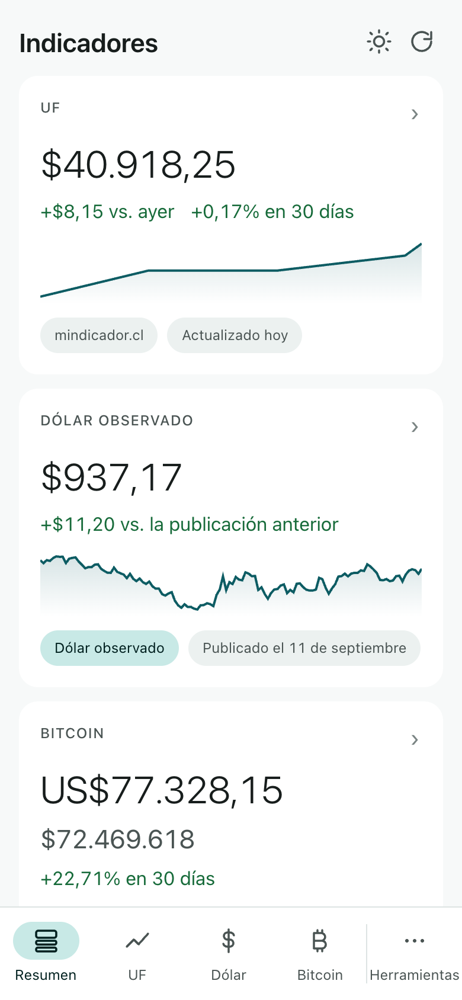
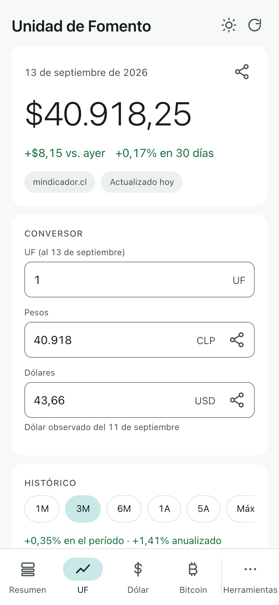
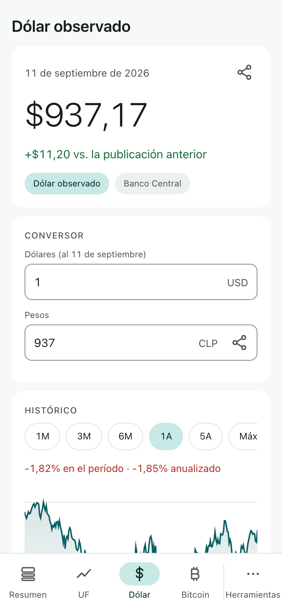
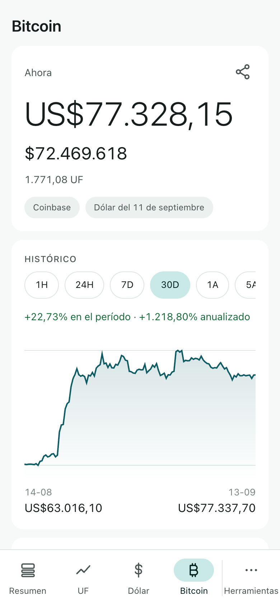
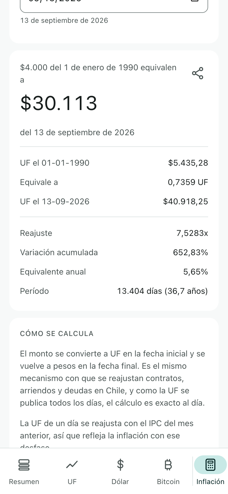
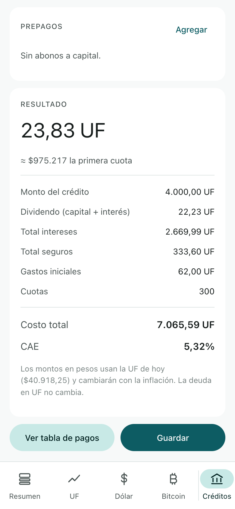
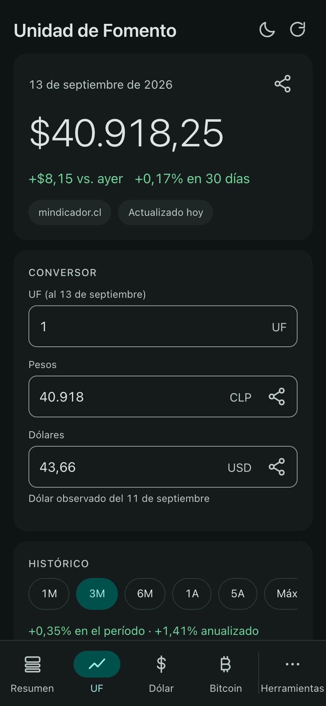

<h1 align="center">
  <br>
  Tickers
</h1>

<p align="center">
  <b>The numbers Chilean money is measured in, in your browser.</b><br>
  <sub>Las cifras con que se mide el dinero en Chile, en tu navegador.</sub>
</p>

<p align="center">
  <a href="https://ellokojavi.github.io/Tickers/"><b>🌐 Open the web app · Abrir la app web</b></a>
</p>

<p align="center">
  <a href="https://github.com/ellokojavi/Tickers/actions/workflows/checks.yml"></a>
  <a href="https://github.com/ellokojavi/Tickers/actions/workflows/deploy-web.yml"></a>
  <a href="https://github.com/ellokojavi/Tickers/actions/workflows/refresh-data.yml"></a>
  <a href="LICENSE"></a>
</p>

| Resumen | UF | Dólar observado | Bitcoin |
|:---:|:---:|:---:|:---:|
|  |  |  |  |

| Inflación | Créditos hipotecarios | Tema oscuro |
|:---:|:---:|:---:|
|  |  |  |

<sub>On a phone-sized screen. A wide window uses a navigation rail and two columns.</sub>

---

## Para usuarios

**Tickers** reúne en un solo lugar la UF, el dólar observado y el bitcoin, con
toda su historia, y dos herramientas para trabajar con ellos: una calculadora
de inflación exacta al día y un simulador de créditos hipotecarios.

- **Resumen.** La pantalla con que abre: la UF, el dólar y el bitcoin uno bajo
  otro, cada uno con su valor de hoy, cuánto se movió, su fuente y una línea de
  tendencia, más el IVP, el euro, la UTM y el IPC. Cada tarjeta es un enlace a
  la pantalla completa de ese indicador.
- **UF.** El valor de hoy, cuánto se movió respecto de ayer y en 30 días, un
  conversor UF ⇄ pesos ⇄ dólares, toda la serie diaria desde agosto de 1977 en
  un gráfico que se recorre con el dedo, la consulta de cualquier fecha y los
  valores ya publicados hacia adelante, marcados como oficiales.
- **Dólar observado.** Cada día hábil desde enero de 1984, con el mismo gráfico
  y conversor. Los fines de semana y feriados no tienen publicación y no se
  inventa ninguna: se muestra el último valor publicado, con su fecha.
- **Bitcoin.** Cotizado en dólares como lo hace el mercado, convertido a pesos
  con el dólar observado del Banco Central y también expresado en UF, que es la
  única forma de leerlo descontada la inflación chilena. Gráficos desde una hora
  hasta cinco años.
- **Calculadora de inflación.** Reajusta un monto entre dos fechas exactas:
  *$4.000 del 1 de enero de 1990 equivalen a $30.089 de hoy.*
- **Simulador de créditos hipotecarios.** Créditos UF + tasa con seguros,
  impuesto de timbres, comisiones, prepagos y CAE, con la tabla de pagos
  completa y exportación a CSV. Las simulaciones quedan guardadas.

Los tres indicadores y el resumen están siempre a la vista en la barra
inferior; las dos herramientas viven detrás del botón **Herramientas**, porque
se visitan a propósito y no todos los días.

**Funciona sin conexión.** Las series completas vienen dentro de la app, así que
todos los gráficos y todas las fechas funcionan desde la primera carga, sin
internet. Cuando lo hay, actualiza el valor del día.

**No recoge nada.** Sin cuenta, sin publicidad, sin seguimiento, sin analítica.
Las simulaciones se guardan solo en tu navegador y no salen de él.

**Nunca inventa un número.** Un valor que no está publicado no se proyecta ni se
estima: la app dice que no existe. Cada cifra lleva su fuente y su fecha.

**Cada pantalla tiene su dirección.** Se puede mandar un enlace directo al
bitcoin o a la calculadora, guardarlo en marcadores y volver con el botón atrás
del navegador, como en cualquier sitio.

**Cómo tenerla.** Anda a
[ellokojavi.github.io/Tickers](https://ellokojavi.github.io/Tickers/). Funciona
en cualquier navegador actual, también sin conexión una vez abierta. En un
teléfono se puede dejar en la pantalla de inicio y queda como cualquier otra
app, tanto en Android como en iPhone; en un computador, como marcador. La
propia app explica los pasos que pide tu navegador.

## For users

**Tickers** brings together the UF, the observed dollar and bitcoin, with their
whole history, plus two tools to work with them: a day-exact inflation
calculator and a mortgage simulator.

- **Resumen.** The screen it opens on: the UF, the dollar and bitcoin one under
  the next, each with today's value, how it moved, where it came from and a
  trend line, plus the IVP, the euro, the UTM and the CPI. Every card is a link
  into that indicator's full screen.
- **UF.** Today's value, its change since yesterday and over 30 days, a UF ⇄
  peso ⇄ dollar converter, the entire daily series since August 1977 in a chart
  you can scrub, a lookup for any date, and the days already published into the
  future, labelled as official.
- **Dólar observado.** Every business day since January 1984, with the same
  chart and converter. Weekends and holidays have no publication and none is
  invented: the last published value is shown, with its date.
- **Bitcoin.** Priced in dollars as the market does, converted to pesos with the
  Banco Central's observed rate, and expressed in UF as well, the only way to
  read it net of Chilean inflation. Charts from one hour to five years.
- **Inflation calculator.** Restates an amount between two exact dates:
  *$4.000 of 1 January 1990 is worth $30.089 today.*
- **Mortgage simulator.** `UF + x%` loans with insurance, stamp tax, fees,
  prepayments and the CAE, the full payment schedule and a CSV export.
  Simulations are saved.

The overview and the three indicators are always in the bottom bar; the two
tools sit behind a **Herramientas** button, because they are visited on purpose
rather than daily.

**It works offline.** The complete series ship inside the app, so every chart
and every date works from the first load with no connection. When there is one,
it refreshes the day's value.

**Nothing is collected.** No account, no ads, no tracking, no analytics.
Simulations are stored in your browser only and never leave it.

**It never makes a number up.** A value that has not been published is neither
projected nor estimated: the app says it does not exist. Every figure carries
its source and its date.

**Every screen has its own address.** A link to bitcoin or to the calculator
can be sent, bookmarked and walked back out of with the browser's back button,
like anywhere else on the web.

**Getting it.** Go to [ellokojavi.github.io/Tickers](https://ellokojavi.github.io/Tickers/).
It runs in any current browser and works offline once opened. On a phone it can
be added to the home screen, where it behaves like any other app on both
Android and iOS; on a computer, as a bookmark. The app itself gives the steps
your browser needs.

---

## For engineers

Tickers is a web app in TypeScript and Preact, served from GitHub Pages as a
PWA with no backend of its own. Everything that produces a number lives in
`domain/`, with no DOM in it, and is pinned by golden fixtures that the test
suite reads. The rest of the documentation lives in [`docs/`](docs/):

| Document | What it covers |
|---|---|
| [Architecture](docs/ARCHITECTURE.md) | The app layer by layer, the decisions behind it, and the project layout |
| [Data](docs/DATA.md) | Where every number comes from, what the sources' terms require, how the data is validated and repaired, and how it is refreshed daily |
| [Calculations](docs/CALCULATIONS.md) | The inflation index derived from the UF, the mortgage model and its rate conventions, the CAE solver, bitcoin in UF |
| [Requirements](docs/REQUIREMENTS.md) | The functional and non-functional requirements the app is held to |
| [Testing](docs/TESTING.md) | What each suite asserts, the bugs the suites caught, a postmortem, and the manual checklist |
| [Design](docs/DESIGN.md) | The mark and its icons, and the interface rules |
| [Working agreements](CLAUDE.md) | The rules for changing this repository, starting with the one that keeps this page true |

This page is not maintained on trust. Its version, its test counts, its links,
its screenshots and the tabs it names are all checked against the code by
`web/src/__tests__/docs.test.ts`, on every push and every pull request, so a
change that outdates the README fails in the commit that made it.

### Principles

- **Never invent a value.** Unpublished days are refused, not extrapolated.
  Weekends have no dollar. A chart ends today even when the series runs past
  it. A lookup never answers with a neighbouring day's value.
- **Money is exact.** `big.js` throughout; a `number` never touches a peso.
  Formatting is `es-CL` on every figure, counts included, and the separators
  and month names are the app's own rather than the browser's.
- **Offline first.** The complete UF and dollar series ship with the page,
  regenerated every morning by a workflow and validated before they land. The
  network only ever refreshes the day's value.
- **The figures are pinned.** Every engine's output is fixed in `web/golden/`
  as exact strings, never generated from the engine itself, so changing a
  figure is always a deliberate edit.
- **Nothing leaves the device.** No analytics, no account. Simulations live in
  `localStorage`.

### Building

Node 22:

```bash
cd web
npm ci
npm run dev       # serves on :5173
npm test          # 125 tests, the last seven of them checking this page
npx tsc --noEmit  # types
npm run build     # type-check, then a static build in web/dist
```

The data generators in `tools/` and the daily refresh are described in
[Data](docs/DATA.md#regenerating-the-bundled-series); deployment is in
[Architecture](docs/ARCHITECTURE.md#building-and-deploying).

### Status

Version **0.9.1**, in daily use. It is held below 1.0 for one reason: the
mortgage simulator's default annual-to-monthly rate convention has not yet been
checked against a published bank quote. Both conventions are selectable and the
screen says so, but until that check is done, calling it 1.0 would overstate it.

**Toward 1.0:** validate the default rate convention against bank quotes; PDF
export of payment schedules; side-by-side comparison of simulations.
**Considered, not committed:** UF change notifications, UTM and tax
calculators.

Tickers shipped as a native Android app in Kotlin and Jetpack Compose until
September 2026, alongside this one and held to the same numbers by shared
golden vectors. It was removed to make this a single product on a single
channel; `android-final` is the last commit that contains it.

---

## Disclaimer

Tickers is an independent tool. It is not affiliated with, endorsed by, or
connected to the Comisión para el Mercado Financiero (CMF), the Banco Central de
Chile, the Instituto Nacional de Estadísticas (INE), or any bank or exchange.

Figures are provided for information only and are **not** financial advice. A
mortgage simulation is a model, not a quote: lenders apply their own
conventions, fees and insurance pricing. The bitcoin price is a market
reference, not a buy or sell quote. Always confirm with the institution before
making a decision.

## License

MIT. See [LICENSE](LICENSE).
